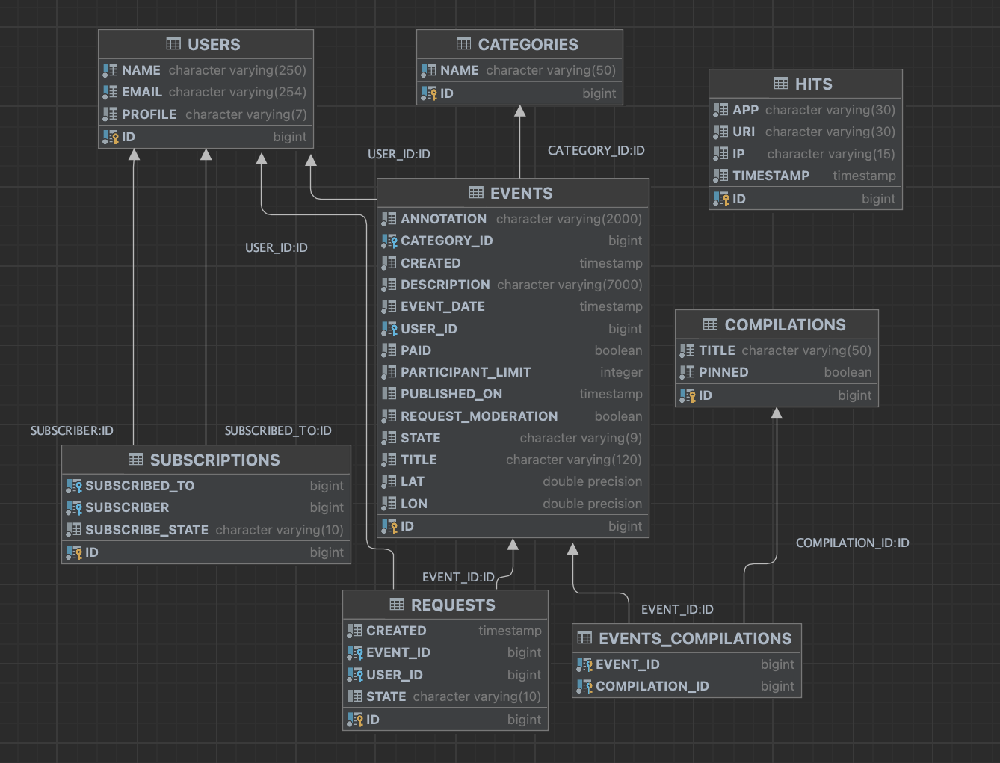

# Explore With Me


### About Project
Explore with me is an educational project for developers studying at [Yandex Practicum Java Developer](https://practicum.yandex.ru/java-developer/) course.
This repository contains a backend for the social network for organizing events and searching for participants.

### About Stack
Technologies were used:
+ Java
+ Spring Boot
+ Maven
+ PostgreSQL
+ Hibernate

### About Architecture
+ MSA
+ Two services: main-service and stats-service

### About Functionality

+ **Stats-service**

    + service collects statistics of event views
+ **Main-service**

    + service process the core business logic of the project and CRUD-operations with entities

### About API


Learn more information about endpoints and provided JSON - objects in project documentation:
+ [main-service](ewm-main-service-spec.json)
+ [stats-service](ewm-stats-service-spec.json)


### About Entity-Relationship model




### About Run


Use Maven for packaging and just ```docker-compose up``` it! 🐳